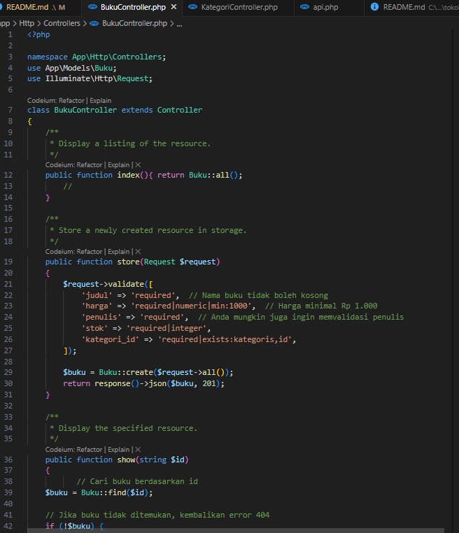
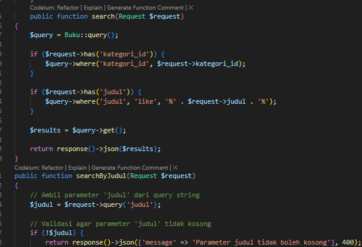
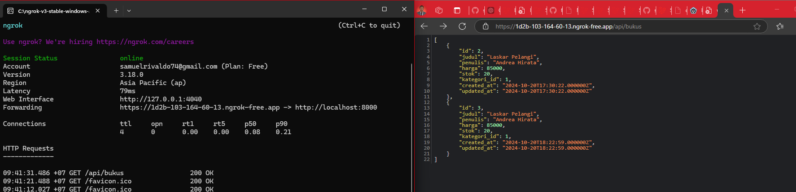
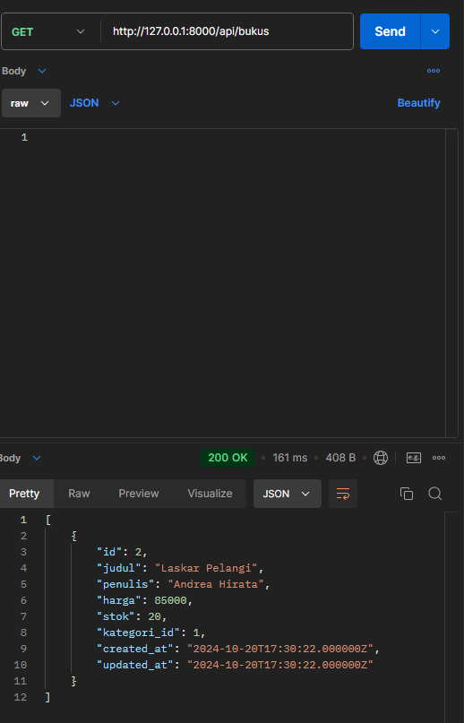
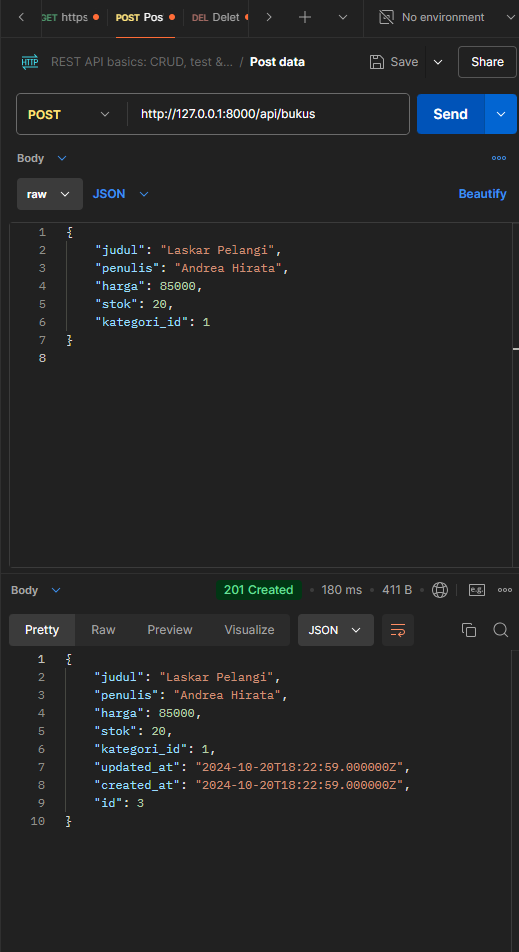

Tugas Mahasiswa
1.	Tambahkan Validasi:
o	Nama buku tidak boleh kosong.
o	Harga minimal Rp 1.000.

2.	Rancang Endpoint Baru:
Buatlah satu endpoint tambahan untuk sistem toko buku, misalnya, endpoint untuk mencari buku berdasarkan kategori atau judul. Tantangan: Apa pertimbangan yang harus Anda buat saat merancang endpoint ini? Pertimbangkan aspek performa, skalabilitas, dan pengalaman pengguna.

3.	Uji API Secara Publik:
o	Gunakan ngrok atau sejenisnya untuk membuka API ke internet.

Jawaban:
Ditambahkan validasi dan endpoint ununtk pencarian buku

1. Tambahkan Validasi

2. Endpoint baru(Pencarian Buku Berdasarkan Kategori atau Judul)
di Tambahkan fungsi baru search

3. Uji Api Secara Publik Menggunakan Ngrok

 

4.  Uji Api dengan menggunakan Postman & Chrome
GET

POST

Chrome

